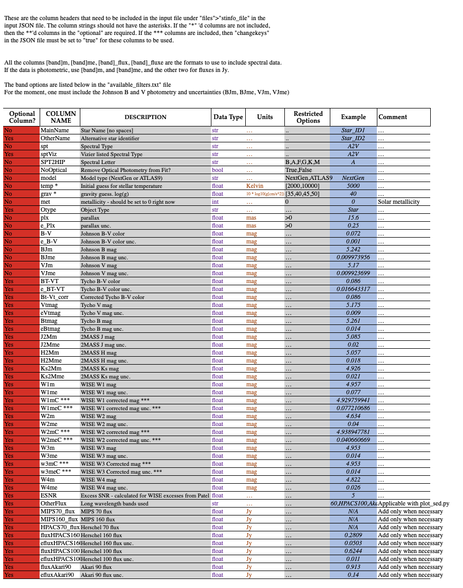

User Input File
*******************

The stellar input file contains all the metadata required for each star whose spectral energy distribution (SED) you wish to model. In the `JSON parameterfile <https://github.com/astropatel/twinkle/blob/master/paramfile.json>`_ (see the :doc:`Set-Up page<set_up>`) the file path is described as

.. code-block:: rst

    ['folders']['topdir']/['folders']['supportdir']/StellarInputFiles/user_input_stardata.xlsx

where, in the parameter file, and in the project repo example, it's

::

    twinkle-master/Inputs_and_Models/StellarInputFiles/user_input_stardata.xlsx.

The input file is an excel file, with a header where each column corresponds to a different meta-data parameter for each star. Each subsequent line contains information for a different star.

You can have multiple sheets in your excel file -- maybe you want to have different versions of the same input data. You can specify which sheet you want to use through the ``['files']['input_stars_sheet']`` parameter in the JSON parameterfile.

Below is a simple stellar input file (broken up for easier viewing, but it would be a 3 row by 20 column file) that includes optical photometric data and some mid-infrared `WISE data <https://www.jpl.nasa.gov/missions/wide-field-infrared-survey-explorer-wise/>`_. You can download the contents of this input file and others `here <https://github.com/astropatel/twinkle/tree/master/Inputs_and_Models/StellarInputFiles>`_.

   +-----------+-----+--------+----------+--------+------+
   | MainName  | spt | SPT2HIP| NoOptical| model  | temp |
   +===========+=====+========+==========+========+======+
   | Star_ID1  | A2V | A      | FALSE    | NextGen| 8000 |
   +-----------+-----+--------+----------+--------+------+
   | Star_ID2  | B5V | F      | TRUE     | ATLAS9 | 8000 |
   +-----------+-----+--------+----------+--------+------+

   +-----+-----+-----+-------+-----+------+-----+------+
   | grav| met | plx | e_Plx | B-V | e_B-V| BJm | BJme |
   +=====+=====+=====+=======+=====+======+=====+======+
   | 40  | 0   | 15.6| 0.25  | 0.07| 0.001| 5.2 | 0.01 |
   +-----+-----+-----+-------+-----+------+-----+------+
   | 45  | 0   | 20  | 0.3   | 0.1 | 0.001| 5.7 | 0.01 |
   +-----+-----+-----+-------+-----+------+-----+------+

   +-----+------+----+------+-----+------+
   | VJm | VJme | W1m| W1me | W2m | W2me |
   +=====+======+====+======+=====+======+
   | 5.1 | 0.01 | 4.9| 0.07 | 4.6 | 0.04 |
   +-----+------+----+------+-----+------+
   | 5.9 | 0.01 | 6.2| 0.07 | 4.6 | 0.04 |
   +-----+------+----+------+-----+------+

The file shows meta-data for two stars, `Star_ID1`, and `Star_ID2` under the ``MainName`` column. All the columns up to ``e_B-V`` are not optional. This of course implies that the photometric columns are optional. You don't technically need to include any photometric bands, besides Johnson `B` & `V` but then you wouldn't get anything modeled. So you SHOULD include SOME photometric bands.

.. important::
    For the moment, one must include the Johnson B and V photometry and uncertainties (``BJm``, ``BJme``, ``VJm``, ``VJme``).

A full stellar input file can be found in the `project repo here <https://github.com/astropatel/twinkle/tree/master/Inputs_and_Models/StellarInputFiles>`_. You'll see a number of different columns that you can use for your simulation. The file ``Input_StarFile_Description.xlsx`` (also included in the project repo) contains information for all acceptable meta-data columns in your input stellar file, as well as column `Descriptions`, `Data Type`, `Units`, `parameter restrictions`, `examples` of the data, and whether the column is optional for the simulation or not. The image and truncated/scrollable table shows what you'll find in the ``Input_StarFile_Description.xlsx`` file.

.. _input_file_description_image-label:

.. raw:: html

   

       Description of meta-data that can be found and used in the stellar input file. 
       Scroll vertically and horizontally to see the full file.
   

.. raw:: html

   

.. xlsx-table::
    :file: ../../Inputs_and_Models/StellarInputFiles/Input_StarFile_Description.xlsx
    :start-row: 2
    :start-column: 1
    :header-rows: 1
    :include-rows: 2-59
    :include-columns: 1-8

.. raw:: html

   

The photometric bands that can be used to calculate the SED and excess flux are listed in the  file located ``~/Inputs_and_Models/RSR/available_filters.txt``. More information on the relative spectral response (RSR) files can be found on the :ref:`Model Data Page<RSR_Description-label>`.

To see what the output of the modeling would look like with different meta-data in the stellar input file, check out the `Jupyter Notebook tutorial <https://github.com/astropatel/twinkle/blob/master/Twinkle_Tutorial.ipynb>`_.

.. important::
    The column strings should not have the asterisks. If the \* columns are not included,
    then the \*\* columns in the "optional" column are required. If the \*\*\* columns are included, then "changekeys" in the JSON file must be set to "true" for these columns to be used.

.. important::
    To include spectral data columns, the parameter names should be in the following format: ``[band]m``, ``[band]me``, ``[band]_flux``, ``[band]_fluxe``. If the data is photometric, use ``[band]m``, and ``[band]me``, and the other two for fluxes in Jy.

