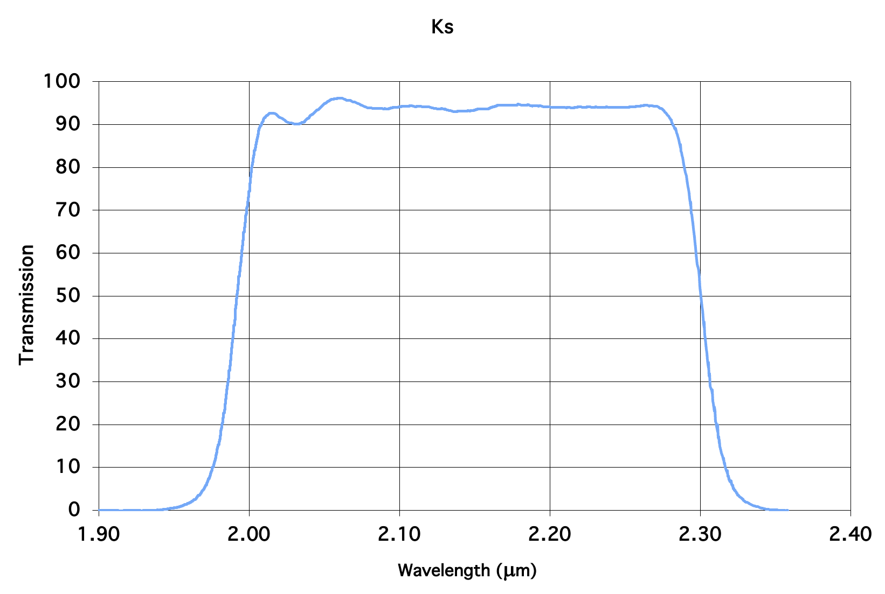

Model Data
===============

Stellar Grid Models
*********************

The stellar grids are the backbone (or another important structural body part analogy) of `Twinkle` and essential to any SED modeling effort. These are stellar atmopsheric models that have been calculated/generated for a grid of stars at a range of temperatures, solar-relative metallicities, and gravities. Simply, they're models of wavelength vs. flux for stars that we use to model calculate the best fit to the empirical photometric data you provide `Twinkle`.

`Twinkle` relies on two main atmospheric models: The `Kurucz Atlas 9` (`Kurucz 1993 <https://ui.adsabs.harvard.edu/abs/1993yCat.6039....0K/abstract>`_) and the `NextGen` atmospheric models (`Hauschildt et al. 1999 <https://iopscience.iop.org/article/10.1086/306745>`_).

Both model files should be in the project path as shown in the set-up section (XXX - link to page) and listed in the JSON input file ``['folders']['topdir']``/``['folders']['supportdir']``/StellarGridModels/ (e.g., `twinkle-master/Inputs_and_Models/StellarGridModels/`).

For quick access you can find the models on the Github page, (XXXX - link here)

.. note:: I have primarily set `ATLAS9` for SED modeling late B-spectral type stars, while the `NextGen` models are best for A-K spectral types.

.. note:: You can set the model you want to use in the stellar input file (xxx insert link to page) under the ``model`` column, and this can be changed for different stars in your input file.

.. _atlas9-label:

ATLAS9
*******************

A description of the `ATLAS9` models can be found in this file :download:`README <_static/README_ATLAS9.txt>`. It includes a description of model temperature ranges, wavelength ranges, and grid steps. There's also a table of which models are optimal for a given spectral type.

 .. note::

    There are also newer (I think) `ATLAS9` models that can be accessed `here <https://www.stsci.edu/hst/instrumentation/reference-data-for-calibration-and-tools/astronomical-catalogs/castelli-and-kurucz-atlas>`_.

Right now, the code only has access to `ATLAS9` grid models with stellar metallicities relative to solar of 0.0 and -0.5. To include more metallicities, feel free to download more metallicity folders from the author, and add it to the `ATLAS9` directory labeled as `k[x][s]`, where `x` is either `m` for `minus (-)` or `p` for `positive (+)`, and `s` refers to the two digit absolute solar relative metallicity value (Z = [M/H]).

The file format of the `ATLAS9` models are in standard FITS format. Each file corresponds to flux for a star at a given metallicty and temperature.

For instance, `km05_10000.fits` is the FITS file for the `ATLAS9` atmospheric stellar model at 10000K for metallicity of Z=-0.5.

Each file has a Primary header, and a second Binary Table that has 12 columns, the first corresponding to the wavelength, and the next 11 corresponding to the surface flux units ( :math:`\mathrm{ergs}\  \mathrm{cm}^{-2}\ \mathrm{s}^{-1} \mathrm{Å}^{-1}`) at different surface gravities (:math:`10\log(g)`; from 0 to 50.0 in increments of 0.5).

.. code-block:: PYTHON

    from astropy.io import fits
    import numpy as np

    hdu = fits.open('km05_10000.fits')
    hdu.info()

    >> Filename: km05_10000.fits
    >> No.    Name      Ver    Type      Cards   Dimensions   Format
        0  PRIMARY       1 PrimaryHDU      27   ()
        1                1 BinTableHDU     56   1221R x 12C   [1E, 1E, 1E, 1E, 1E, 1E, 1E, 1E, 1E, 1E, 1E, 1E]

    temp = hdu[0].header['TEFF']
    data = hdu[1].data
    colnames = np.array(hdu[1].columns.names)

    print(temp)
    >> 10000

    print(colnames)
    >> array(['WAVELENGTH', 'g00', 'g05', 'g10', 'g15', 'g20', 'g25',
    'g30','g35', 'g40', 'g45', 'g50'], dtype='<U10')

We can see the Binary Table is a 1221 row by 12 column table, where the values in the row for the ``WAVELENGTH`` column is the wavelength of the flux, and the values in all the other columns are the flux at a given wavelength for the surface gravity listed in the column name (g00, g05, etc.)

.. _nextgen-label:

NextGen
*******************

As I mentioned before, you should specify to the code to use the NextGen atmospheric grid models for spectral types A-K. I originally downloaded the spectra (.spec) files from the late Dr. France Allard's page.

As of now, the most readily accessible models the code can use are of solar metalicity (Z=0), with relevant surface gravities of log(g) from 3.5 to 5.5 in increments of 0.5.

The current processed files are in the NextGen folder with each file labeled in the format of `lteNextGen_[TEMP]_[GRAV]_[MET].txt`. ``TEMP`` is the stellar temperature, ``GRAV`` is the surface gravity, and ``MET`` is the metallicity. Each file is a two-column text file, where the first column is wavelength in Angstroms, and the second is flux in :math:`\mathrm{ergs}\  \mathrm{cm}^{-2}\ \mathrm{s}^{-1} \mathrm{Å}^{-1}`.

Each of these files is created using the (XXX module - treat_NextGenSpecModels) function, which loads the raw spec files, and outputs the `lte` format text files. The spec files are provided, so feel free to extract more spec files for your use. These currently include Z=-0.5, 0, 0.5,. If you want more, either download them yourself, or contact me.

.. _RSR_Description-label:

Photometric Filter Response Curves
************************************

The relative spectral response (RSR) curve  files contain information on how a given photometric filter response is distributed across a wide-band spectrum. Basically, each filter or instrument that observes a star has a varying weighted response to the light across a wide-band wavelength regime.

For instance, the Ks-band in the NIRC2 instrument on Keck looks like this:

The image shows the percentage of light that passes through the filter at a given wavelength in the range of 1.9 to 2.4 microns. `Twinkle` takes this filter (and other relevant ones) and convolves it with the modeled photospheric emission and sums the flux over that bandpass. We then use the summed flux at the central or isophotal wavelength for the flux at that wavelength.

All the filter files should be placed in the project path as shown in the set-up section (XXX - link to page) and listed in the JSON input file ``['folders']['topdir']``/``['folders']['supportdir']``/RSR/ (e.g., `twinkle-master/Inputs_and_Models/RSR/`).

A list of available filters can be found in the readme file in the downloaded project folders (XXX link on github) or :download:`here <_static/Filters_ReadME.txt>`. This file also contains references from where the filters were obtained, as well as information on what the header line for each filter file contains in section I.

.. important::

    All the relative spectral responses are exactly that. All the :math:`\lambda\mathrm{RSR}` needs to be divided out

.. note:: The list of available filters may not be up to date in the readme file, so take a look in the RSR folder to see for sure.

.. note:: The filters available at the moment are from WISE, NIRC2, Spitzer MIPS, 2MASS, Johnson, Bessel, Tycho, Hipparcos, IRAS, Herschel/PACS, Akari, MSX, DENIS, and early Gaia G

If you want to create your own reponse curve to be read by `Twinkle`, it needs to be in the format like the example below:

.. raw:: html

   

.. literalinclude:: _static/W1_WISE.dat
   :language: text
   :caption: WISE W1 RSR File Formatted for Twinkle Use

.. raw:: html

   

.. raw:: html

   

       WISE W1 RSR File Formatted for Twinkle Use
   

The file snippet shows the response curve data for the Wide-Field Infrared Survey Explorer (WISE) W1 filter. The second line contains the column header for the wavelength (microns) and the transmission.

The first line contains a header with bandpass specific information in the following format:

**#!N0[0,f]/ N1[1,f]/ N2[2,f]/ N3[3,f]/ N4[4,f]/ N5[5,f]/**

where

N0 = Isophotal wavelength (Angstroms)

N1 = Vega zero point flux (:math:`\mathrm{ergs}\  \mathrm{cm}^{-2}\ \mathrm{s}^{-1} \mathrm{Å}^{-1}`)

N2 = uncertainty in Vega zero point flux (:math:`\mathrm{ergs}\  \mathrm{cm}^{-2}\ \mathrm{s}^{-1} \mathrm{Å}^{-1}`)

N3 = Isophotal frequency (Hz)

N4 = Vega zero point flux (:math:`\mathrm{ergs}\  \mathrm{cm}^{-2}\ \mathrm{s}^{-1} \mathrm{Å}^{-1}`)

N5 = uncertainty in Vega zero point flux (:math:`\mathrm{ergs}\  \mathrm{cm}^{-2}\ \mathrm{s}^{-1} \mathrm{Å}^{-1}`)

All this information can be found in the readme file linked above.

